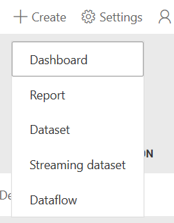

# Garmin Device Connect IQ IoT App
**produced by Dave Lusty**

## Introduction
This guide details how to configure the IoT watch app with Azure Services

## Prerequisites

Before getting started with this app you'll need to have a few things. Firstly you'll need a compatible (Garmin device)[https://developer.garmin.com/connect-iq/compatible-devices/]. Different devices have different capabilities so not all of them will be able to send all metrics.

Next, you'll need the Connect IQ SDK, the Eclipse IDE and the Java JRE installed. Instructions for setting these up can be found in the (Garmin getting started guide)[https://developer.garmin.com/connect-iq/programmers-guide/getting-started/].

# Environment 1


Of the two methods shown here, environment 1 is the simplest. This architecture uses a Logic App with HTTP endpoint to ingest data and push this to the Power BI streaming data service. This is simple to configure but not as scalable as the Event Hub version below.

## Power BI

Log in to [Powerbi.microsoft.com](https://powerbi.microsoft.com/en-us/) and create a new app workspace called ConnectIQ Demo. Once created, add a streaming dataset.



## Logic App

Create a Logic App in your subscription, call it ConnectIQAPI and choose a suitable location.


Once created, open the Logic App and add a trigger for HTTP request received. Set the method to POST and save your Logic App. This will fill in the URL which you'll need to copy into the source code of the ConnectIQ App.


Next, add a Parse JSON task and add in the body of the request as the content. In order to fill in the schema you may like to set up the app and receive a sample payload, for instance if you've modified the app in some way. For now, fill in the schema with the below:

```JSON
{
    "properties": {
        "altitude": {
            "type": "number"
        },
        "cadence": {
            "type": "integer"
        },
        "heading": {
            "type": "number"
        },
        "heartRate": {
            "type": "integer"
        },
        "latitude": {
            "type": "number"
        },
        "longitude": {
            "type": "number"
        },
        "power": {
            "type": "integer"
        },
        "pressure": {
            "type": "number"
        },
        "speed": {
            "type": "number"
        },
        "temp": {
            "type": "integer"
        },
        "xAccel": {
            "type": "integer"
        },
        "xMag": {
            "type": "integer"
        },
        "yAccel": {
            "type": "integer"
        },
        "yMag": {
            "type": "integer"
        },
        "zMag": {
            "type": "integer"
        }
    },
    "type": "object"
}
```


# Environment 2


This environment uses an Azure Event Hub to ingest messages. As such this would be much more scalable and allows for copying data to a data lake for later analytics. Stream Analytics then takes these events and pushed them on to Power BI for the demo environment.

## Storage Account

## Event Hubs

## Stream Analytics

## Power BI