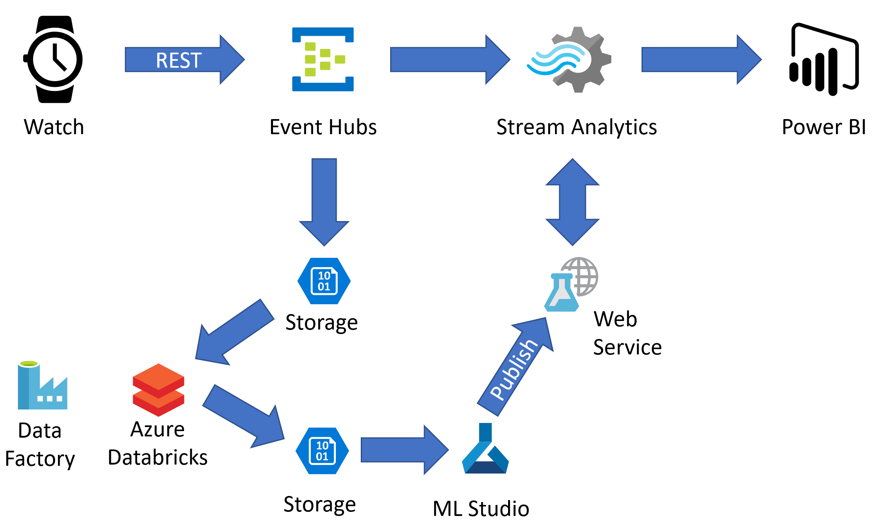

# Heart Rate data anomoly detection
**produced by Dave Lusty**

# Introduction
This guide details how to use the data generated by the Garmin watch application to train a machine learning model. In this demo we'll generate some resting HR data, then transform it with Data Factory and Azure Databricks. Finally we'll train a model using a "one class SVM" algorithm for anomoly detection before publishing that model as a web service. The one class SVM uses statistical analysis to detect outlier data, so when we generate new data with unusual values (such as during exercise) it will detect an anomoly.

You can find videos of this demo and the rest in the series on Youtube at the following locations:
[Part 1 - Intro](https://youtu.be/_39eKRNK3UU)
[Part 2 - Initial Platform Build](https://youtu.be/9llyGjfKiLo)

The architecture for this demo is shown below.

## Prerequisites
You'll need to have completed the previous demo so you can generate some useful data to train the model with. You can find this at [Watch demo infrastructure](https://github.com/davedoesdemos/ConnectIQ-Watch-IoT/blob/master/IoTWatchInstructions.md) but if you don't have a device you can skip over to YouTube and see the demo videos instead.

# Generate data
If you have previous test data in your storage account, open that account and delete the entire container and data. For this demo to work, we need some stable resting heart rate data so the previous data might not be useful. Please bear in mind we're doing this so the demo works - in real life we don't ordinarily cheat like this with our data sets for machine learning. Once deleted, recreate the storage container so that new data will have somewhere to go.
Next, sit in a chair and relax for a few minutes. Lying down will also work. Once relaxed, start the demo app on your watch to start recording "resting" data. Continue to relax for a few minutes to gather a reasonable amount of training data. Stop the app on your watch and check that you have some data in your storage account.

# Data Transformation

## Azure Databricks

## Data Factory

# Machine Learning

## ML Studio

# Testing